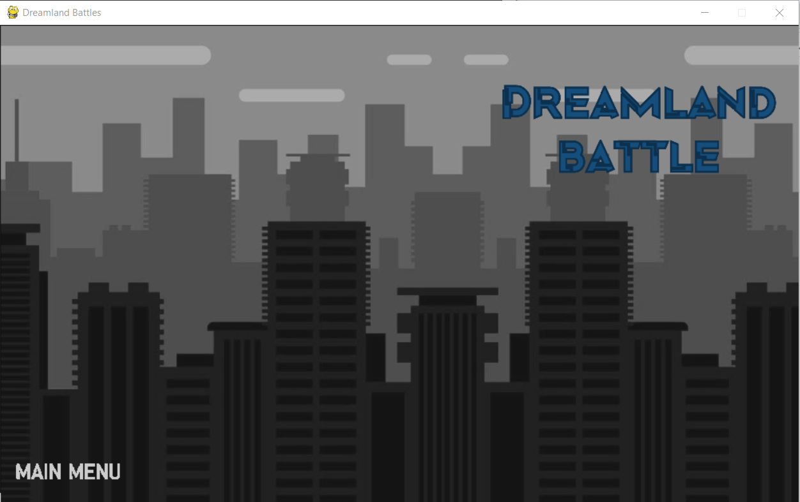
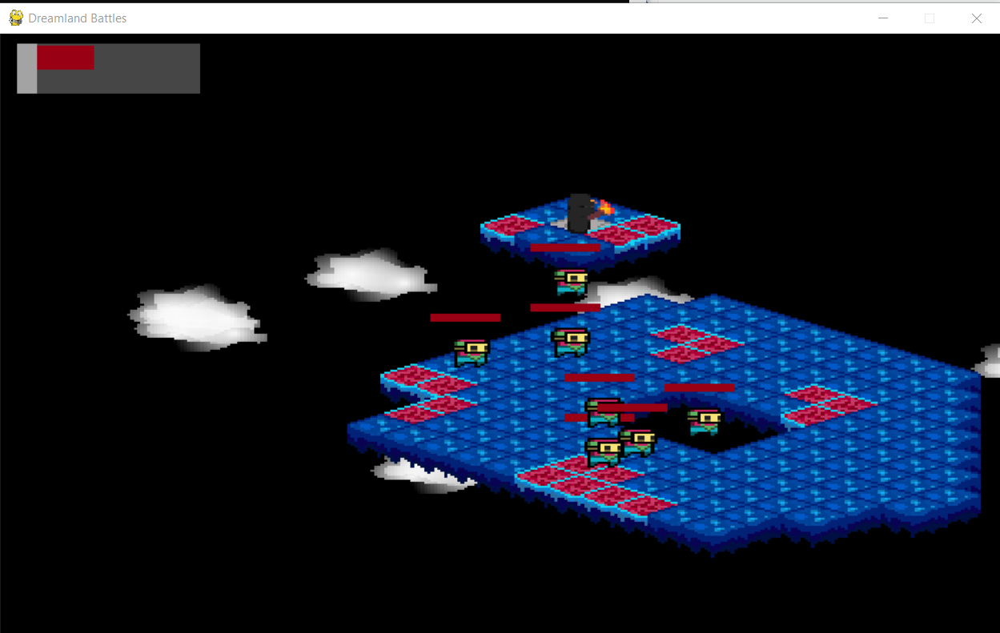
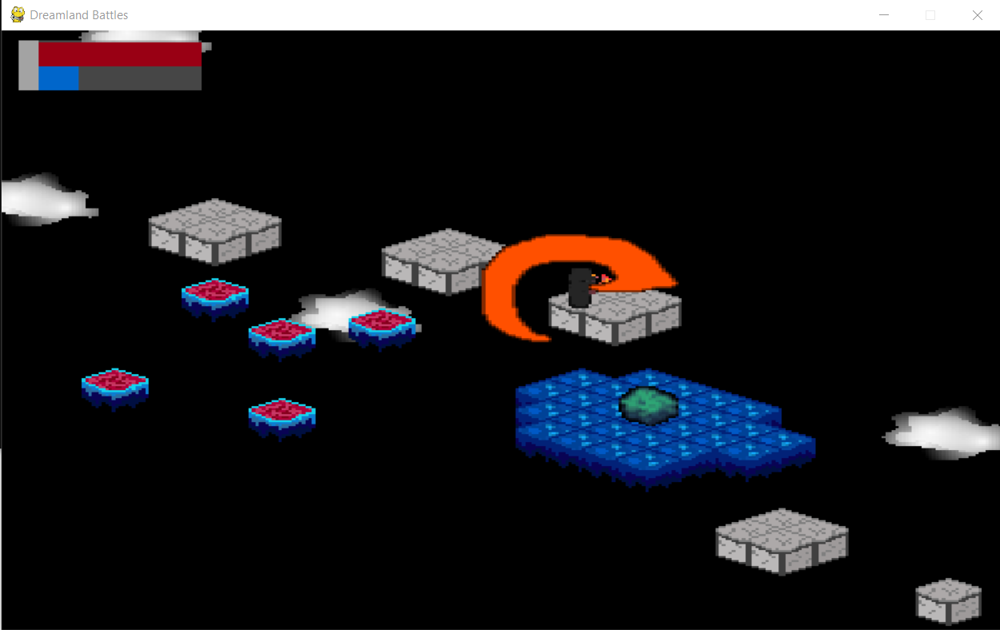
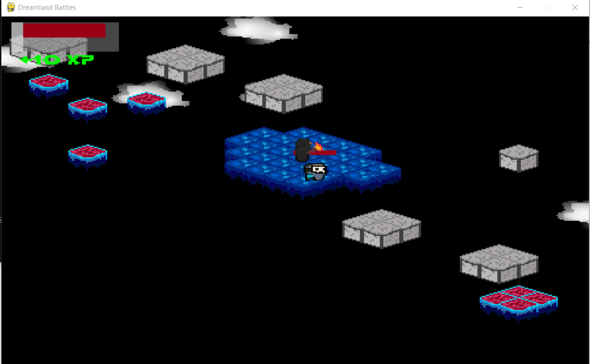

<h2 align="center">Jeu Projet Orale NSI 1Ere</h2>

Dreamland battle est un jeu à monde ouvert ou le but est d'explorer des mondes en quête de butin, de combats ou encore de boss. Réalisée grâce à la librairie pygame pour mon projet d'orale de première NSI.

</a>  </a>  <space>    </space><space> </space><space> </space>
 

